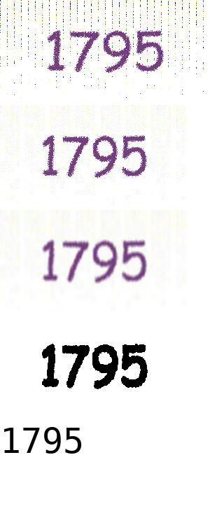

# Some Scraping-Related Findings

This repository contains findings, experiments, and code related to the solving and bypassing of CAPTCHA's to obtain documents from [redacted: the site we are investigating].

In general, we seek efficient ways of querying the path `/News/NewsList.aspx` and obtaining documents at paths like `/News/ShowNews.aspx?Code=14065595` at scale.
Often, these pages are blocked by a CAPTCHA.

## Dependencies

[Tesseract OCR](https://opensource.google.com/projects/tesseract)

Python 3, tested with the following:

```
requests==2.18.4
beautifulsoup4==4.6.0
numpy==1.14.2
Pillow==5.1.0
pytesseract==0.2.2
```

## The Client

The choice of tools used for acting as the client doesn't matter all that much.
For these experiments so far, I've been using Python 3 with [Requests](http://docs.python-requests.org/en/master/) and [Beautiful Soup](https://www.crummy.com/software/BeautifulSoup/bs4/doc/).
It's up to the programmer to do some work that the browser would do.

The website in question is an ASP.NET server.
Some of what we have to do to simulate the browser looks ugly and hacky, but it's really not that bad.
In particular, we have to deal with ASP.NET's View State mechanism.
More on that later.
The relevant code is in the funciton `mk_captcha_form_data` in [./web_util.py](./web_util.py).
Note that this server only accepts certain `User-Agent`'s, so I just copied my browser's value into my script.

Another approach would be to use a headless browser.
Denise and Ali's code uses Selenium for this.

## Dealing with CAPTCHA

I've only looked at the CAPTCHA flow for paths like `/News/ShowNews.aspx?Code=14065595`, but I'd bet the search form is the same.

If you make a GET to `/News/ShowNews.aspx?Code=14065595` and the server isn't convinced you are a human, the result is a page that doesn't have the content you asked for, but rather a CAPTCHA image:
```html

```
and a form:
```html
<form name="form1" method="post" action="./ShowNews.aspx?Code=14065595" onsubmit="javascript:return WebForm_OnSubmit();" id="form1">
    <input type="hidden" name="__EVENTTARGET" id="__EVENTTARGET" value="">
    <input type="hidden" name="__EVENTARGUMENT" id="__EVENTARGUMENT" value="">
    <input type="hidden" name="__VIEWSTATE" id="__VIEWSTATE" value="vq1OljhTXvuksdiv0OWe9...(lots of stuff)...UQgsjrY5S1Ka4=">
    <input type="hidden" name="__VIEWSTATEGENERATOR" id="__VIEWSTATEGENERATOR" value="D9260202">
    <input type="hidden" name="__VIEWSTATEENCRYPTED" id="__VIEWSTATEENCRYPTED" value="">
    <input type="hidden" name="__EVENTVALIDATION" id="__EVENTVALIDATION" value="J5m3FwmZa4OtXxov/JKHTxsJSI82+uw24jvea/HB4E1prMGtKAChIYgZLNKhIkrwjsjTLl+JZguAe6aFXztg+OfbCN4+nTTjhuOwdi3mUfcFCGcKKIRz0RuXZjzzDLSHI9HjHJ7JwFwz/TDVstODGQpJc/J5oGXytX8Hobey62w=">
    <input type="submit" name="ctl00$cphMain$btnCaptcha" value="ارسال" onclick="javascript:WebForm_DoPostBackWithOptions(new WebForm_PostBackOptions(&quot;ctl00$cphMain$btnCaptcha&quot;, &quot;&quot;, true, &quot;&quot;, &quot;&quot;, false, false))" id="cphMain_btnCaptcha" class="btnSearch">
    <input name="ctl00$cphMain$captcha$txtCaptcha" type="text" id="txtCaptcha" class="cInput" dir="ltr" autocomplete="off" style="width:60px;">
</form>
```

POSTing this form (the `onsubmit` JavaScript really just submits the form) with the correct solution the CAPTCHA in the `ctl00$cphMain$captcha$txtCaptcha` field results in a response that is the actual document you sought in the first place.

From here, I tried to figure out how this flow could be modified to make obtaining the target document easier.

#### CAPTCHA URL's

First, let's take a look at the CAPTCHA image endpoint.
Here's the absolute URL from the form above:
```
http://[redacted]/HttpHandler/Captcha.ashx?w=185&h=92&c=bvYFHFKcJ3AyZtlZ2i/F9g==&bc=ffffff&rnd=1464307070
```
This endpoint does not seem to take session into account.
That is, you can get an image from that URL without the same cookie as the one in the request that yielded that URL in an image tag.
For example, you can get an image from that URL in a new incognito window.
Each time you get it, the digits may move around a bit, and they may change color, but that's all that changes.

The `w` and `h` parameters are width and height parameters.
You can change them to whatever you want.
Larger images look like they'd be much easier for OCR, but the server takes a while to generate them.
300x150 seems to me like it could be a sweet spot.

The `bc` parameter is the background color.
You're free to choose that, too.

Clearly, there is some sort of RNG involved in the generation of the image (foreground color, digit placement, etc.), even for a fixed URL.
The `rnd` parameter could effect that RNG, but its effect isn't noticeable from the client because there is RNG anyways.
From what I can tell, it can be set to anything (or omitted) and make no difference to the client.

The `c` parameter, then, seems to solely determine the digits that will appear.
It also seems very likely that the server can statelessly determine the digits to display from the `c` parameter.
I say this because CAPTCHA images do not depend on session state, and so implementations that would have this property just make a lot more sense.
For example, the `c` parameter may be the result of encrypting the digits that are to be displayed.
That way, the solution is opaque to the client with the URL, but the server can decrypt that parameter for both displaying and checking the CAPTCHA just from the URL.

I also strongly suspect that there is a 1 to 1 correspondence between possible `c` parameters and 4-digit numbers (the solutions).
I wrote a script that fetched and solved new CAPTCHA's, and it found repeats pretty quickly (which is not statistically surprising under the assumption of this 1-1 correspondence).
If the `c` parameter is, in fact, an encrypted 4-digit number (an implementation that would make a lot of sense, and fits observations), then they could have thrown in some random bits to get rid of this flaw, but I guess they didn't.
This would mean that there are only 10000 CAPTCHA's.
We would be able to set up a global cache for our scrapers so that only 1 CAPTCHA for each 4-digit number would have to be solved by our infrastructure.

It's worth noting that if you make up a `c` parameter, most of the time you just get an empty CAPTCHA image, with just the lines in the background.

#### Solving CAPTCHA's

Luckily, the CAPTCHA images themselves are really bad.
Tesseract (Google's open source OCR engine) generally can't solve the CAPTCHA's on its own, but it can after simple transformations.
If our approach ends up requiring us to solve CAPTCHA's, we will have to figure out the right balance between speed and accuracy.

Denise and Ali's code, for example, crops and blurs them, then hits them with Tesseract.

Another approach, which I've taken in this repository, involves more transformations, and is thus a lot slower, but maybe more accurate.
First, the image I end up asking for is larger than the default (400x200 instead of 185x92).
Then, the following transformations are applied:
- Remove columns whose average darkness in the top 6th of the image is above a
  certain threshold (has the effect of removing those dark lines in the background)
- Blur the image
- Make lighter pixels white and darker pixels black

After these transformations, Tesseract can usually (70-80%?) get the right answer.
The relvant code can be found in [./solve_captcha.py](./solve_captcha.py).
Here is an example of its transformations (the last pane is the guess):

<p align="center"></p>

#### Trying to Bypass CAPTCHA

Spoiler: I haven't found anything very useful, but also I also haven't determined that bypassing isn't possible.

It's natural to wonder whether there is a way to mess with the GET, form, POST, etc. flow I described earlier to bypass CAPTCHA completely.
I had to familiarize myself with some ASP.NET mechanics to investigate (I've never written a line of C# in my life).
Here's what I found.

Imagine a world without JavaScript.
One approach to dynamic web pages that you might come up with is the following:
- User issues GET for a certain path X.
- Server sends a web page where controls (e.g. checkboxes) are part of a form, and their state is stored as a hidden field for that form.
- User clicks checkbox, resulting in the form to be POSTed to path X.
  The POST contains the form with the event somehow contained in it (perhaps the clicked checkbox was a field in the form or something) and the old state of the controls.
- Server returns the same page, except where the controls are in the state preserved in the previous form's state field, except updated to reflect the change that caused the POST.
  Other bits of the page may be changed to reflect the new state of the checkbox.
  For example, other controls might appear.
  This new page's form contains the updated state in a hidden field, like before.

Because software is mysterious, ASP.NET still uses this approach for certain things.
The state I described is the `__VIEWSTATE` field in the form at the top of this write-up.
[This article](https://msdn.microsoft.com/en-us/library/ms972976.aspx) describes this mechanism in more detail.
TBH I didn't read the whole thing.

The presence of the empty `__VIEWSTATEENCRYPTED` field indicates that the View State is encrypted.
This means that it's opaque to the client, and that we can't modify it.
However, we can reason about what it contains (and, more importantly, what it doesn't contain) in order to try to find a way around the CAPTCHA.

The POST that actually yields us the document we want really only contains 3 bits of important information:
- Request path (e.g. `/News/ShowNews.aspx?Code=14065595`)
- Session cookie (looks like `ASP.NET_SessionId=qjlrpgwpkpgusp2c2hawhzk1`)
- Form data

Upon receiving such a post, the server must determine whether the CAPTCHA solution is correct.
It's safe to assume that the View State contains some information that determines the expected answer to the CAPTCHA image sent along with it (for example, the solution itself).
Otherwise, outstanding CAPTCHA's and the requests they're bound to would have to somehow be associated with the session, which wouldn't really make sense.
So, let's assume that something like the CAPTCHA solution is in the View State.

Given a correctly completed form (that is, View State and CAPTCHA solution match), what can we do with it?
To find out, I used both the interception/modification feature of [mitmproxy](https://mitmproxy.org/) and code in [./web_util.py](./web_util.py) and [./flow.py](./flow.py).

The only positive result I got is that, once you have a good session/form pair, you can change the URL of the POST and get a different document.
For example, if you GET `/News/ShowNews.aspx?Code=14065595`, you can change the action of the form to target `/News/ShowNews.aspx?Code=14066178` instead, and you will receive the document at the latter path.
You need to use the same cookie you used to get the form, though.
This means that one process could get CAPTCHA forms and solve them, and another process could recieve a prepared session/form pair, and then get whatever document it wanted.
I'm not sure how useful that is.

Unfortunately, it seems that the View State is bound to a session, and can't be reused.
So, it seems like there isn't much more room for messing around.
I very well could be wrong about this, though.
My knowledge on ASP.NET is limited and I am very tired.
